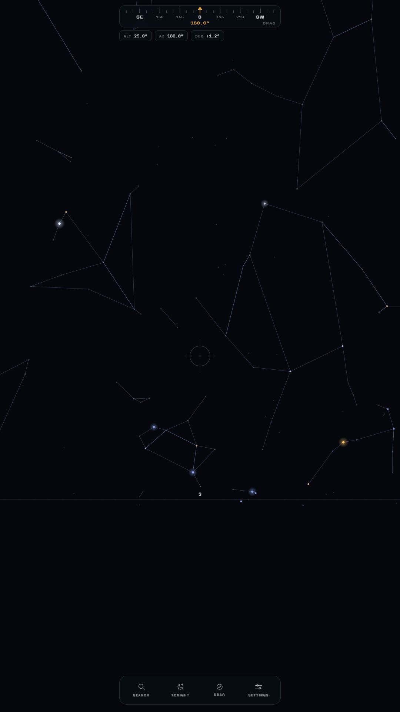
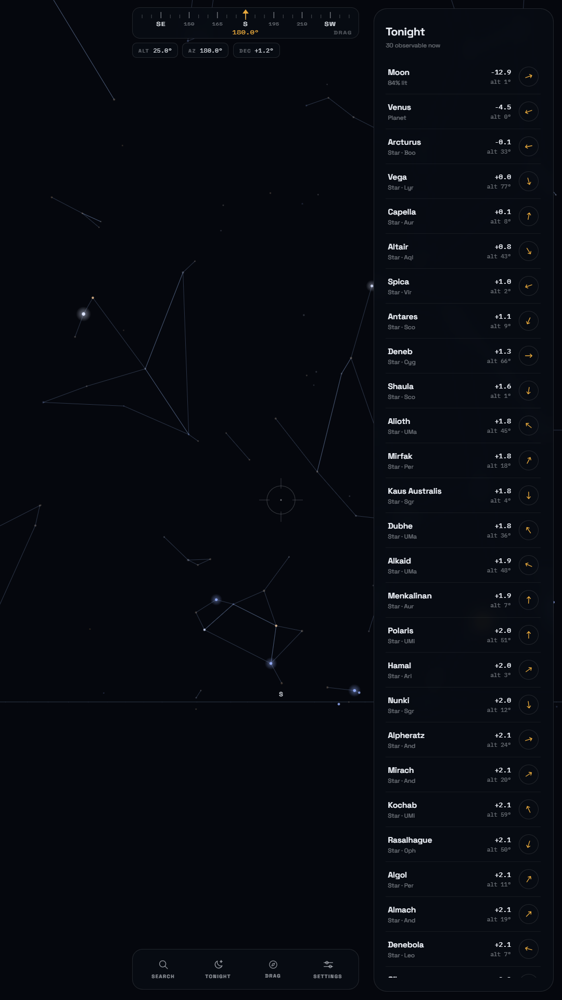

# StarGaze

Point your phone at the night sky and it tells you what you are looking at.

**[Try it in a browser](https://ramskandh-thirandasu.github.io/stargaze/)** — the same
bundle the Android app wraps. Drag to look around; on a phone, allow sensors and
it follows where you point.

<p align="center">
  
  
</p>

No image recognition. A phone photo of the night sky is a noisy black square
with a few faint dots in it — there is nothing there for a vision model to work
with. The apps that do this well don't look at the sky at all. They ask three
sensors:

- **GPS** — your latitude and longitude. The stars over Bengaluru are not the
  stars over Reykjavík.
- **The clock** — the exact instant. The sky turns 15° an hour.
- **Magnetometer and gyroscope** — the direction and angle the camera is aimed
  at.

Those three fully determine your view. From there it is spherical trigonometry
against a star catalogue: cheap, exact, and runs on a budget phone.

## Getting started

```bash
npm install && npm run data && npm test
npm run dev
```

`npm run data` builds the catalogues into `packages/web/public/data/` (Python
3.9+, no pip packages — see [tools/README.md](tools/README.md)). Its output is
committed, so this is only needed if you change the pipeline.

The client runs at `http://localhost:5173` and opens on a permission gate.
**Skip — just show me the sky** goes straight to drag mode, which needs no
sensors and is how most of this was developed.

## Testing on a phone

Camera, geolocation and motion are all gated behind a **secure context**.
`http://192.168.1.42:5173` is not one, and the failure is silent — no error, no
prompt, just a page that never asks for anything.

```bash
npm run serve        # built client over HTTPS, prints every LAN address
npm run dev:https    # same, with hot reload
```

The phone warns about the self-signed certificate once. That warning is
expected, not a failure — accept it and the sensors start working.

The [live site](https://ramskandh-thirandasu.github.io/stargaze/) sidesteps this
entirely, as does the Android build: the WebView serves from `https://localhost`.

### First run on a real phone

Nothing here has been confirmed on hardware with a magnetometer. Worth walking
through in order, because a failure early on explains the ones after it:

1. **Does a heading appear at all?** The `AZ` readout should change as you turn.
   If it stays fixed, this device is not reporting an absolute heading.
2. **Does it say so when it can't?** With no compass the app should offer drag
   mode and say why — not sit there looking frozen.
3. **Does the camera show?** Rear camera only. A selfie view means the wrong
   camera was picked.
4. **Does the overlay sit on the Moon?** The one target you can check by eye.
   Expect it to be off by degrees before calibrating — that is the compass, not
   the astronomy.
5. **Does calibration help?** Settings → *Calibrate on a known star*, sight the
   Moon or a bright planet, confirm. The overlay should visibly tighten.
6. **Do permissions ask once?** Close the app fully, reopen. It should not
   re-prompt for anything already granted.
7. **Does it survive rotation?** Turn the phone to landscape. The sky should
   stay put; only the chrome should move.
8. **Does it work in airplane mode?** Enable it, force-close, reopen. Everything
   should still load — this is the whole point of the app.

## Android

```bash
npm run android:sync    # build the web bundle and copy it into android/
npm run android:open    # ...and open Android Studio
```

**Needs JDK 21**, and only 21. Gradle 8.x (pinned by Capacitor's AGP 8.x)
rejects newer JDKs with `Unsupported class file major version` — 25 and 26 both
fail, and Android Studio's bundled JBR is one of them. Upgrading Gradle is not
the way out, since Capacitor pins the chain.

Point `JAVA_HOME` at a JDK 21 and `./gradlew` works from any shell:

```bash
# one-off, or set JAVA_HOME persistently for your user
JAVA_HOME=/path/to/jdk-21 ./gradlew assembleDebug
```

The debug APK lands at `android/app/build/outputs/apk/debug/app-debug.apk`
(~8.9 MB, the whole sky inside it). Sideload it with:

```bash
adb install -r android/app/build/outputs/apk/debug/app-debug.apk
```

Emulators fake the magnetometer, so the compass — the one genuinely uncertain
part of this — can only be judged on a real phone.

## Layout

```
tools/       Build-time Python: catalogues in, JSON out. Never runs in the app.
packages/
  core/      On-device astronomy. No DOM, no network, no state. 118 tests.
  web/       Vite PWA client. public/data/ holds the generated catalogues.
server/      Express + a self-signed cert, for testing on a real phone.
android/     Capacitor project wrapping the same web build.
```

## How it fits together

Everything runs on the device. The Python in `tools/` runs once at build time
and its output is committed; the app loads five JSON files totalling **~57 KB
gzipped** and does the rest itself. That is what lets it work in a field with no
signal, which is exactly where it gets used.

Per frame, `packages/core` runs this chain:

1. `julianDate(new Date())` — when
2. `localSiderealTime(jd, longitude)` — which part of the sky is overhead
3. `toHorizontal(...)` — the catalogue into your sky, as altitude and azimuth
4. `basisFromDeviceOrientation(...)` — where the phone is pointed
5. `project(...)` — your sky onto the screen

Steps 1–3 change slowly and run on a timer. Steps 4–5 run every frame.

## On being right

Positional astronomy is full of sign flips and degree/radian slips that produce
answers which look plausible and are wrong. Two things guard against that.

**The ephemeris is checked against JPL Horizons.** `tools/fetch_reference.py`
pulls real positions for the Sun, Moon and planets at six epochs spanning
2021–2045; the tests assert against them offline. Measured worst case:

| Body | Error | Body | Error |
|---|---|---|---|
| Sun | 13.5″ | Jupiter | 368.3″ |
| Mercury | 21.7″ | Saturn | 435.0″ |
| Venus | 18.0″ | Uranus\* | 110.2″ |
| Mars | 31.7″ | Neptune\* | 34.4″ |
| Moon (topocentric) | 16.5″ | | |

\* Computed and tested but never drawn — see *What it shows*.

Every one is inside JPL's published bound for this element set: they document
400″ for Jupiter and 600″ for Saturn, because a fixed ellipse cannot express the
giant planets perturbing each other. The test tolerances are those published
numbers, not numbers picked to make the suite green. For scale, a phone compass
is off by **5–15°** — 18,000–54,000″. The ephemeris is nowhere near the limiting
factor.

Applied on top of the catalogue positions: atmospheric refraction, Delta-T,
proper motion, nutation, annual aberration, and topocentric parallax.

**The geometry is checked against physical facts.** Polaris sits at your
latitude. An object on your meridian at your declination is overhead. Things
rise in the east. Lie the phone flat and the camera looks at the floor. Tap a
pixel and unprojecting it returns the direction that projects back onto it.

That second set is not ceremony. Writing it caught a real bug: the up axis was
computed as `forward × right` instead of `right × forward`, which renders the
entire sky vertically mirrored — and passes an orthonormality check, because a
down-vector is still a perfectly good orthonormal basis vector. Only a test that
asked "is higher actually higher on screen" found it.

Two more the tests caught: the magnetic model used Gauss-normalised Legendre
functions where IGRF assumes Schmidt quasi-normalisation, putting it **24° out**;
and the planets were rotated into equatorial coordinates with the obliquity of
date rather than of J2000, quietly mixing reference frames.

Because fixtures only prove a moment in time, a monthly workflow re-checks the
ephemeris against a **fresh** Horizons epoch, re-verifies IGRF against NOAA's
published values, and hash-pins the upstream catalogues. It opens an issue on
failure rather than failing quietly.

## What it shows

Only what you could actually photograph with a phone, standing on the ground.

**Five planets** — Mercury, Venus, Mars, Jupiter, Saturn. Uranus (magnitude
~5.7) and Neptune (~7.9) are computed and tested but never drawn: a phone cannot
record either, and a marker hovering over empty sky teaches you the overlay is
unreliable at exactly the moment you are deciding whether to trust it.

**1,009 stars to magnitude 4.5** — roughly a phone's reach handheld under a
genuinely dark sky. All 88 constellation figures stay complete: line vertices
ship whatever their brightness.

**The Moon**, the easiest thing in the sky to photograph and the best target for
checking the overlay is aligned.

Objects that are up but washed out by daylight or moonlight are still drawn,
dimmed, and listed as washed out rather than silently dropped — "there, but you
won't see it" is useful; vanishing is not.

## Known limits

- **The compass is the weak link**, by a wide margin. Phone magnetometers are
  good to ±5–15°, worse near metal, speakers or a car. Everything else here is
  accurate to arcseconds. Settings → *Calibrate on a known star* corrects for it:
  sight something you can see, confirm, and the offset is stored. Up to three
  sightings can be combined; the correction expires after 14 days or a 20 km
  move, since it only describes one magnetic environment.
- **The compass is only as good as the magnetometer.** Sensor fusion comes from
  Android's `TYPE_ROTATION_VECTOR` via `SensorManager.getOrientation`, so the
  platform owns the axis conventions rather than this code re-deriving them.
  Confirmed tracking on an Android device. Indoors it is not worth trusting at
  all — desk metal, speakers and building steel pull it by tens of degrees,
  which is what the interference warning is for.
- Magnetic declination is interpolated on a 5° grid, stops at ±85° latitude, and
  is flagged stale past IGRF-14's 2030 forecast window rather than extrapolated
  quietly.
- Rise/set for the Moon assumes a fixed position across the day, so its times are
  good to a few minutes rather than seconds.
- No deep-sky objects, and Saturn's rings are not modelled.

## Credits

Star and constellation data, planetary elements and the geomagnetic model are
all free to use — see [NOTICE.md](NOTICE.md).

## License

MIT — see [LICENSE](LICENSE). Bundled datasets keep their own licenses; see
[NOTICE.md](NOTICE.md).
